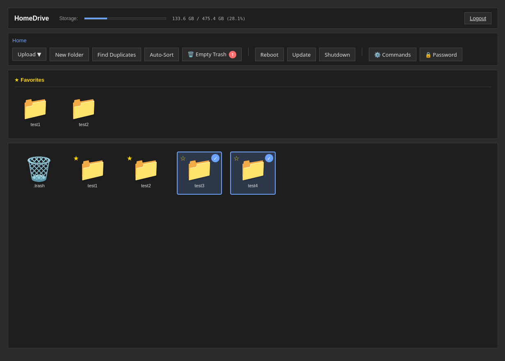

# HomeDrive

A self-hosted network file storage solution for home and LAN environments. HomeDrive provides a simple, secure alternative to cloud storage services like OneDrive and Google Drive without the complexity of Docker, containers, or Nextcloud.

## Vision

HomeDrive is designed for households and families who want control over their data without technical overhead. It runs as a single executable on any Linux machine, making personal file storage accessible to users who want simplicity and reliability.

## Installation

Download the executable from latest release,
put it in a folder,
run it via terminal ./homedrive_x86,
go through the setup wizard
-> DONE!

On first run, the interactive setup wizard will guide you through:
1. Setting an admin password
2. Configuring HTTPS (optional)
3. Choosing a network port
4. Setting up system operations via Polkit (optional)
5. Installing as a systemd service (optional)

## Features

- Web-based file browser with breadcrumb navigation
- Upload files and folders (preserves directory structure)
- Download, rename, move, and organize files
- Create and manage folders
- Multi-file selection with drag-and-drop support
- Favorites system for quick folder access
- Trash system with 30-day retention
  
- Real-time disk usage monitoring
- Duplicate file detection with optimized hash algorithm
- Automatic file sorting by type (Images, Documents, Videos, Audio, etc.)
- Thumbnail generation for images
  
- Password-protected access with Argon2 hashing
- HTTPS/SSL support (self-signed or Let's Encrypt)
- CSRF protection on all operations
- Rate limiting on login attempts
- Session management with automatic timeout
- Path traversal validation
  
- Single executable deployment
- Systemd service support for auto-start
- Polkit integration for passwordless system operations
- System shutdown and reboot from web interface
- Package update management (supports apt, dnf, pacman, zypper, rpm-ostree)

## Requirements

- Linux (x86_64) if you want to run on ARM you need to rebuild it on an ARM system.
- Python 3.6 or higher
- OpenSSL (for HTTPS)
- 100MB minimum free disk space

## Technical Details

- **Backend**: Python 3, Flask web framework
- **Frontend**: HTML5 + Vanilla JavaScript (no build step required)
- **Authentication**: Argon2 password hashing with session management
- **File Operations**: Atomic operations with thread-safe locking
- **Streaming**: Supports large file uploads/downloads via chunked transfer

## Logging

Application logs are written to `homedrive.log` in the application directory, including:
- Login attempts and authentication events
- File operations (create, delete, move, rename)
- System operations (shutdown, reboot, updates)
- Errors and warnings
